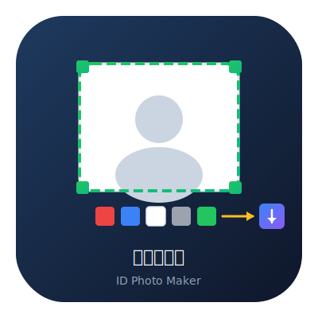

<div align="center">

# 智能证件照制作工具



**PySide6 + Qt Designer，UI/逻辑分离模式制作证件照工具**

[](LICENSE)
[](pyproject.toml)
[](https://pypi.org/project/PySide6/)
[](https://pypi.org/project/opencv-python/)

</div>

基于 **PySide6 + Qt Designer + OpenCV** 的桌面端证件照制作工具。用于Python编程学习，项目采用 **Qt Designer（`.ui` 文件）设计 UI**，经 `pyside6-uic` 编译后以 **多继承模式** 加载，实现 UI 与业务逻辑的真正分离。AI 抠图使用 **rembg**（可选，自动降级 HSV）。

---

## 功能一览

| 功能 | 说明 |
|:---|:---|
| 📁 **上传图片** | 支持 PNG / JPG / JPEG / BMP / TIFF |
| 📷 **摄像头拍照** | 调用系统摄像头实时预览并抓拍 |
| ✂️ **交互式裁剪** | 绿色裁剪框，支持拖拽移动 + 8 方向缩放，比例锁定 |
| 🎨 **背景替换** | 红 / 蓝 / 白 / 灰 / 绿 五种底色，AI 抠图或 HSV 降级方案 |
| 📏 **标准尺寸** | 11 种国家标准证件照尺寸预设（一寸/二寸/护照/签证等） |
| 👁️ **实时预览** | 拖拽 / 切换背景 / 切换尺寸时即时更新效果 |
| 💾 **导出保存** | 支持 PNG / JPEG / BMP，中文路径自动容错 |
| ⚡ **350ms 防抖** | 拖拽裁剪框时延迟触发处理，平衡交互流畅度与计算性能 |

---

## 快速开始

### 环境要求

- **Python ≥ 3.10**
- **[uv](https://docs.astral.sh/uv/)**（推荐）或 pip

### 安装与运行

```bash
# 克隆仓库
git clone https://github.com/ICodeWR/id-photo-maker.git
cd id-photo-maker

# 方式一：使用 uv（推荐）
uv sync
uv run python -m src.main

# 方式二：使用 pip
pip install -r requirements.txt
python -m src.main
```

### 可选：启用 AI 抠图

```bash
uv sync                    # rembg 已包含在依赖中
# 首次运行自动下载 ~180MB 模型，后续使用无需等待
```

> 📌 rembg 首次运行时会自动下载 U²-Net 预训练模型（~180MB），下载速度取决于网络环境。  
> 无 rembg 时自动降级为 HSV 绿幕键控方案，功能不受影响。

---

## 📁 项目结构

```
photoidmaker/
├── pyproject.toml                  # uv 项目配置 + 依赖声明
├── LICENSE                         # MIT 开源许可证
├── README.md                       # 项目说明（本文档）
├── CONTRIBUTING.md                 # 贡献指南
├── CODE_OF_CONDUCT.md              # 行为准则
├── .gitignore                      # Git 忽略规则
├── src/
│   ├── __init__.py
│   ├── main.py                     # 程序入口 + MainWindow（多继承加载 UI）
│   ├── crop_widget.py              # 可拖拽/缩放的裁剪框控件
│   ├── image_processor.py          # 图像处理核心逻辑
│   └── ui/
│       ├── main_window.ui          # Qt Designer 源文件（XML，界面布局在此定义）
│       └── ui_main_window.py       # pyside6-uic 编译产物（勿手动修改）
└── output/                         # 默认导出目录
```

---

## 核心技术

### 架构设计

采用 **Qt Designer + 多继承** 模式实现真正的 UI/逻辑分离：

```
main_window.ui (XML)  ── pyside6-uic ──→  ui_main_window.py (Ui_MainWindow)
                                                      ↑ 多继承
                                               MainWindow (main.py)
                                               self.setupUi(self)
```

修改界面时**只需编辑 `.ui` 文件**，重新编译后 `main.py` 无需任何改动（前提是控件 `objectName` 不变）。

### 背景替换

| 方案 | 条件 | 适用场景 |
|:---|:---|:---|
| **AI 抠图**（rembg） | rembg 已安装 | 任意背景、复杂场景、头发丝级精度 |
| **HSV 键控**（降级） | 内置，无需额外依赖 | 绿色幕布背景，快速轻量 |

### 裁剪框控件

- 半透明遮罩绘制，视觉提示清晰
- 鼠标拖拽移动 + 8 方向缩放
- 比例锁定（`set_aspect_ratio`），切换尺寸时自动适配
- 350ms 防抖定时器，避免频繁触发重处理

---

## 贡献

欢迎提交 Issue 和 Pull Request！请阅读 [CONTRIBUTING.md](CONTRIBUTING.md) 了解贡献指南。

### 开发指引

1. Fork 本仓库
2. 创建特性分支：`git checkout -b feature/your-feature`
3. 提交改动：`git commit -m 'Add some feature'`
4. 推送到分支：`git push origin feature/your-feature`
5. 发起 Pull Request

---

## 📄 许可证

本项目基于 **MIT 许可证** 开源，Copyright © 2026 [码上工坊](LICENSE)。  
您可以自由使用、修改、分发本项目，包括商业用途，只需保留原始版权声明。

---

<div align="center">

**码上工坊** · 用 Python 解决真实问题 | 分享实战项目、效率工具和 AI 应用，让代码为你工作


*扫码关注公众号，获取更多技术分享*

</div>
